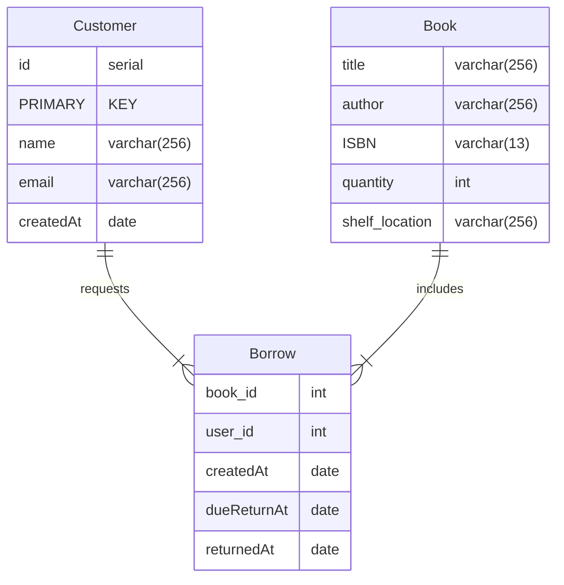

# Book library Express + PostgreSQL Starter Template
This project serves as a simple starter template for building a web application with Express.js and PostgreSQL. It provides a basic API structure for managing books, customers, and a borrowing system with endpoints to perform CRUD operations and query data.

## ERD


## Startup
1. Clone the repository:
	```
	git clone https://github.com/AbdalrahmanHafez/express-book-library-template
	cd project-folder
	```
2. Install dependencies:
	```
	npm install
	```
3. Set up the PostgreSQL database:
	1. Create a PostgreSQL database.
	2. Update the connection string in db.js with your PostgreSQL credentials. Example db.js file:
 		```
   		const { Pool } = require('pg');
		
		const pool = new Pool({
		    user: 'your-username',
		    host: 'localhost',
		    database: 'your-database-name',
		    password: 'your-password',
		    port: 5432,
		});

		module.exports = pool;
   		```
   
	3. run ```db_creation.sql```
 4. Start the server
	```npm start```
	By default, the server runs on ```http://localhost:8080```
